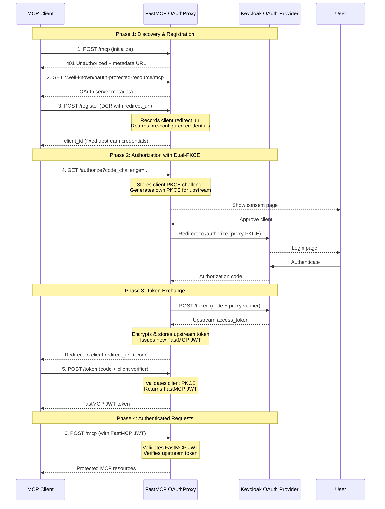

# FastMCP Keycloak OAuth Proxy Demo

A sample FastMCP server demonstrating the **OAuth Proxy pattern** for authenticating with Keycloak, a traditional OAuth provider that doesn't support Dynamic Client Registration (DCR).

## Why OAuth Proxy?

MCP clients expect to use Dynamic Client Registration (DCR) - they want to register automatically and obtain credentials on the fly. However, Keycloak (like most traditional OAuth providers such as GitHub, Google, and Azure) requires manual app registration through an admin console.

The **OAuth Proxy** bridges this gap by:
- Presenting a DCR-compliant interface to MCP clients
- Using pre-registered Keycloak credentials behind the scenes
- Handling callback forwarding for dynamic client redirect URIs
- Issuing FastMCP JWT tokens instead of forwarding upstream tokens directly

This maintains proper OAuth 2.0 security boundaries while providing seamless MCP client integration.

## Key Features Demonstrated

- **OAuth Proxy Pattern**: Bridges DCR-incompatible OAuth providers with MCP clients
- **Dynamic Client Registration Emulation**: Accepts client registration requests and returns pre-configured credentials
- **Dual-PKCE Security**: End-to-end PKCE at both client-to-proxy and proxy-to-upstream layers
- **Token Factory Pattern**: Issues FastMCP JWT tokens instead of forwarding upstream tokens
- **Callback Forwarding**: Supports dynamic client redirect URIs (random localhost ports, fixed URLs)
- **JWT Token Verification**: Validates tokens using Keycloak's JWKS endpoint
- **Consent Screen**: Protects against confused deputy attacks
- **FastMCP Capabilities**: Tools, resources, and prompts examples

## Architecture



## How It Works

1. **The Problem**: MCP clients expect Dynamic Client Registration (DCR) - they want to register automatically and get credentials on the fly. Keycloak requires manual app registration through its admin console.

2. **The Solution**: OAuthProxy presents a DCR-compliant interface to MCP clients while using your pre-registered Keycloak credentials behind the scenes.

3. **The Flow**:
   - When a client registers, the proxy returns your fixed Keycloak credentials and stores the client's callback URL
   - When a client authorizes, the proxy uses its fixed callback URL with Keycloak, then forwards back to the client's dynamic callback
   - The proxy issues its own FastMCP JWT tokens (signed with HS256) instead of forwarding Keycloak tokens directly
   - This maintains proper OAuth 2.0 audience boundaries and enables better security controls

## Prerequisites

- **Python 3.12+**: Required for FastMCP
- **Docker**: For running Keycloak locally
- **uv**: Python package manager (recommended) or pip

## Keycloak Setup

### 1. Start Keycloak with Docker

```bash
docker run -d \
  --name keycloak \
  -p 8080:8080 \
  -e KEYCLOAK_ADMIN=admin \
  -e KEYCLOAK_ADMIN_PASSWORD=admin \
  quay.io/keycloak/keycloak:latest \
  start-dev
```

Access Keycloak admin console at http://localhost:8080 (credentials: admin/admin)

### 2. Create a Client in Keycloak

1. Navigate to **Clients** in the left sidebar
2. Click **Create client**
3. Configure the client:
   - **Client ID**: `mcp_server`
   - **Client authentication**: ON (for confidential client)
   - **Valid redirect URIs**: `http://localhost:8000/auth/callback`
   - **Valid post logout redirect URIs**: `http://localhost:8000`
4. Save the client
5. Go to the **Credentials** tab and copy the **Client secret**

### 3. Configure Environment Variables

```bash
cp .env.example .env
# Edit .env and add your Keycloak client secret
```

Update `.env` with your actual values:

```env
KEYCLOAK_CLIENT_ID=mcp_server
KEYCLOAK_CLIENT_SECRET=<your-client-secret-from-keycloak>
KEYCLOAK_BASE_URL=http://localhost:8080
KEYCLOAK_REALM=master
MCP_SERVER_BASE_URL=http://localhost:8000
```

## Installation

### Using uv (recommended)

```bash
# Clone the repository
git clone https://github.com/vikrantjain/mcp-oauth-proxy-demo.git
cd mcp-oauth-proxy-demo

# Install dependencies
uv sync

# Run the server
python mcp-server.py
```

### Using pip

```bash
# Clone the repository
git clone https://github.com/vikrantjain/mcp-oauth-proxy-demo.git
cd mcp-oauth-proxy-demo

# Create virtual environment
python -m venv .venv
source .venv/bin/activate  # On Windows: .venv\Scripts\activate

# Install dependencies
pip install fastmcp pydantic python-dotenv

# Run the server
python mcp-server.py
```

The server will start on http://localhost:8000

## Usage Examples

### 1. Python Client (FastMCP Client)

```bash
python mcp-client.py
```

This client demonstrates:
- Calling the `greet` tool
- Reading the `resource://profile` resource
- Getting the `ask_about_topic` prompt

### 2. REST Client (VS Code REST Client Extension)

Install the [REST Client extension](https://marketplace.visualstudio.com/items?itemName=humao.rest-client) for VS Code.

#### Simple Flow (client.rest)

For testing with a direct connection (no OAuth):

1. Open `client.rest`
2. Run each request sequentially to test MCP operations

#### Complete OAuth Flow (client-proxy.rest)

For testing the full OAuth Proxy flow with Dynamic Client Registration:

1. Open `client-proxy.rest`
2. Follow the step-by-step OAuth flow:
   - Discovery and metadata retrieval
   - Dynamic client registration
   - Authorization with PKCE
   - Token exchange
   - Authenticated MCP requests

## Project Structure

```
.
├── mcp-server.py           # FastMCP server with OAuthProxy configuration
├── mcp-client.py           # Python client example using FastMCP Client
├── client.rest             # Simple MCP API tests (REST Client)
├── client-proxy.rest       # Complete OAuth flow demonstration
├── pyproject.toml          # Python project dependencies
├── uv.lock                 # Dependency lock file
├── .env.example            # Environment variables template
├── .env                    # Your actual environment variables (gitignored)
├── .gitignore              # Git ignore patterns
├── .python-version         # Python version specification (3.12)
└── README.md               # This file
```

## Security Features

- **Dual-PKCE**: End-to-end PKCE at both client-to-proxy and proxy-to-upstream layers
- **User Consent**: Explicit approval required before client authorization
- **Encrypted Token Storage**: AES-128-CBC + HMAC-SHA256 encryption for stored tokens
- **JWT Signature Validation**: HS256 signature verification for FastMCP tokens
- **Audience Validation**: Prevents token misuse across different services
- **Confused Deputy Protection**: Consent screen prevents malicious client impersonation

## Learn More

- [FastMCP OAuth Proxy Documentation](https://gofastmcp.com/servers/auth/oauth-proxy)
- [FastMCP Documentation](https://gofastmcp.com)
- [MCP Specification](https://spec.modelcontextprotocol.io)
- [Keycloak Documentation](https://www.keycloak.org/documentation)

## License

MIT License - See LICENSE file for details

## Contributing

Contributions are welcome! Please feel free to submit a Pull Request.
